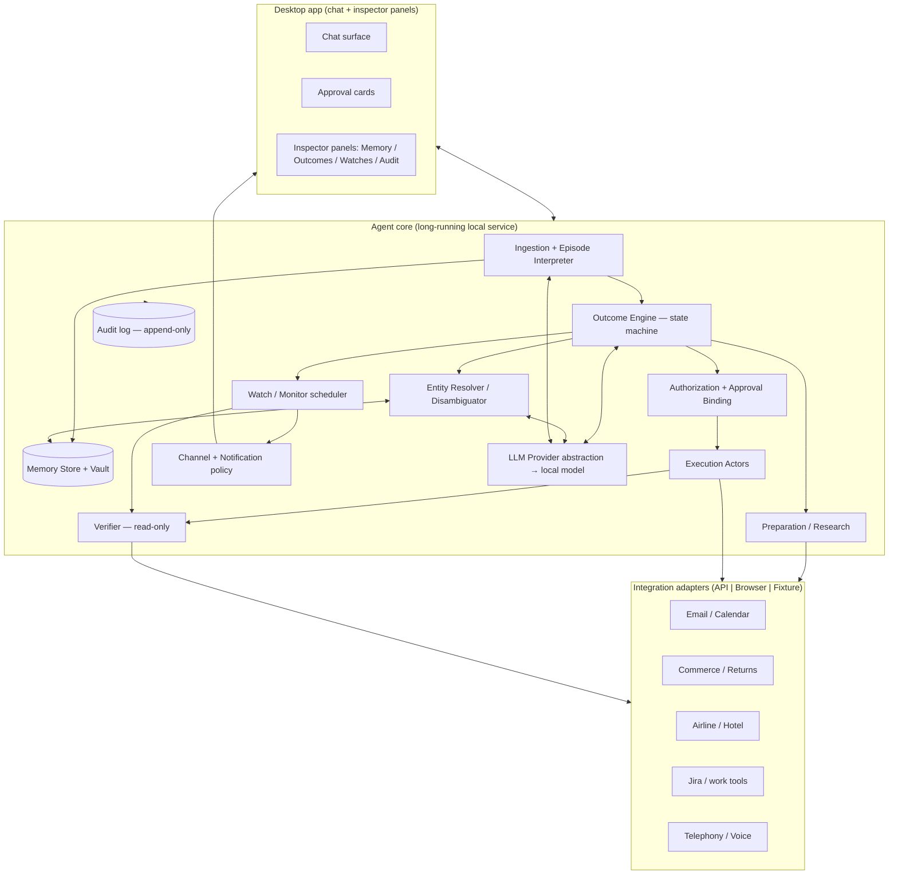
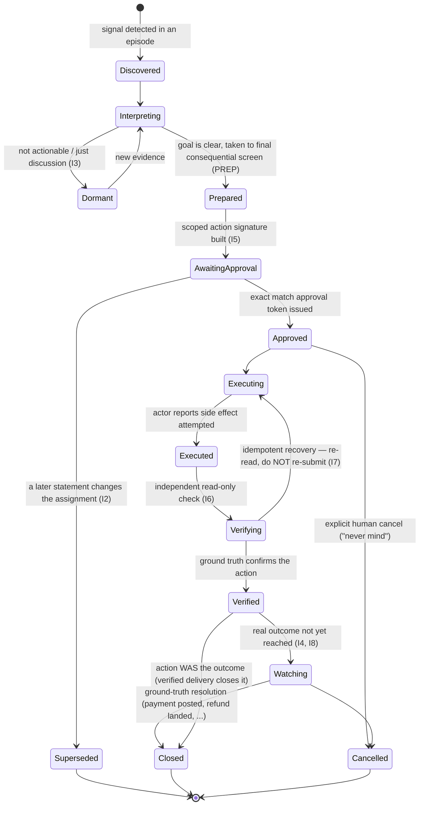

# Anticipy — Technical Build Brief

**Deliverable:** A Windows desktop application that implements the "Anticipy" agent
described below.
**Audience:** A Claude Code (or equivalent agentic coding) session.
**Author's intent:** Recreate the behavioral spec faithfully as a *real, running system*
— not a mockup. Local/self-hosted model, real external integrations, and a UI that is
both a natural chat surface and an inspectable operator console.

---

## 0. How to use this document

You (the coding agent) are building a product called **Anticipy**. Read this entire
document before writing code. It is organized as:

1. What the product is and the invariants that define it (§1–§2)
2. The architecture and the domain model (§3–§4)
3. Per-subsystem specifications (§5)
4. Integrations, UI, stack, and safety (§6–§9)
5. The ten canonical scenarios as executable acceptance tests (§10)
6. A phased milestone plan and testing strategy (§11–§12)
7. Decisions you must make and record (§13), and a glossary (§14)

**Working method requested:**

- In **Phase 0**, make and record the stack decision (§8, §13), scaffold the repo, and
  set up CI that runs the scenario fixtures. Do not skip this.
- Build **subsystem-first**, then wire the ten scenarios on top. The scenarios are
  acceptance tests, not the architecture.
- Every external side effect must go through the **Actor → Verifier** split and the
  **scoped-approval** gate (§2). This is non-negotiable; it is the product.
- Even in "real integrations" mode, **all automated tests run against fixtures**
  (§12). Real credentials are used only in manual/interactive runs.
- Keep a running `DECISIONS.md` (an architecture decision log). Whenever you resolve one
  of the open questions in §13, append the decision and rationale.

> **A note on ambition.** "Full real integrations" is a multi-milestone effort, and a few
> of the scenarios (outbound phone calls, automating airline/retailer flows behind a
> login) carry real legal and terms-of-service constraints. §6 and §9 tell you how to do
> this responsibly: sanctioned APIs where they exist, disclosed+consented calls, and
> user-takeover for credentialed sites. Build the *architecture* to support all ten
> scenarios from day one; light up real integrations tier by tier.

---

## 1. What Anticipy is

Anticipy is an **anticipatory personal agent**. It observes the streams of someone's life
— messages, email, calendar, orders, work tools, travel — and acts on their behalf toward
the **outcome the person actually wants**, not the surface phrasing of what they said.

The canonical example: someone says "we'll have to stop at London Drugs" for a forgotten
toothbrush. Anticipy does **not** open a shopping page on the keyword "London Drugs." It
infers the real goal — *this person needs a toothbrush and would rather not make a special
trip* — checks whether the hotel provides one, and offers a single, disclosed action.

The product is defined less by the actions it can take and more by **how it decides to
act**. The whole value — and the whole risk surface — lives in the discipline of §2.

The primary user in the scenarios is **Omar**. The agent also reasons about other people
in his life (family, cofounders, coworkers, an investor, a boss) with correct handling of
**who has authority over what**.

---

## 2. First principles → engineering invariants

These are the load-bearing rules. Encode each as an explicit mechanism with tests, not as
prompt text the model "usually follows."

**I1 — Outcome, not trigger.** The unit of work is an *Outcome* (a desired end state),
never a keyword or a single sentence. Surface phrases ("London Drugs", "cancel Adobe") are
signals to *interpret*, not commands to execute.

**I2 — Interpret the whole episode; later statements supersede earlier ones.** A
conversation is ingested as an *episode*. Corrections override prior guesses (the cracked
**pot**, not the plant; the **migration project**, not the person). The first
actionable-looking sentence is never grabbed on its own.

**I3 — Discussion ≠ authorization.** Talking about dinner is not permission to book. "I'm
screwed" at the airport is emotion, not approval to spend. Consequential actions always
pass through an explicit approval gate.

**I4 — Action ≠ outcome.** Sending an email is not payment; a QR code is not a refund; a
booked flight is not a boarded flight. An Outcome closes only on **ground-truth
resolution** (a matching ledger payment, a posted refund) or an explicit human cancel.

**I5 — Scoped, single-use, invalidatable approval.** An approval is a token bound to a
precise *action signature* — recipient, item, reason, amount, refund destination, and a
hash of the exact page/version to be acted on. **Any edit invalidates the token.** One
approval authorizes exactly one action (e.g., one disclosed call to one hotel).

**I6 — Actor / Verifier separation.** The component that performs a side effect and the
component that confirms it are different, and the verifier is **read-only**. The actor
saying "done" is ignored; truth is a separately-read Sent message ID / reservation number
/ ticketed itinerary / ledger row.

**I7 — Idempotency.** Side effects carry idempotency keys. After a timeout, Anticipy
**re-reads for an existing result** (an existing return ID, an existing PNR) before it ever
retries. It must never double-submit.

**I8 — Durable watches.** Outcomes that aren't resolved by the action spawn background
*watches* that poll ground truth, drive at most-one follow-up per policy window, honor
timeouts, and move when the world changes ("Dana confirmed Friday" → check ledger Monday,
otherwise stay silent).

**I9 — Entity resolution from context, with an ask-threshold.** People and projects are
resolved from who's asking, the meeting, and domain vocabulary — never name similarity
alone. Three Marcuses / multiple Sarah Chens resolve by context; when confidence is below
threshold, Anticipy asks a disambiguating question and never contacts a human on a guess.

**I10 — Authority & scope are hard limits.** Anticipy accepts only the *narrow*
responsibility offered ("just nudge her" ≠ "run the passport process"). It respects who is
authoritative (the mother is not the source of truth for the sister's availability) and
honors explicit exclusions (don't circulate the budget, don't copy the CEO, don't promise
Monday).

**I11 — Disclosure & audit for external contact.** When Anticipy contacts a third party it
identifies itself as the user's assistant and records who it spoke to, what was promised,
and the ETA. Every consequential action is written to an immutable audit log.

**I12 — Sensitivity, provenance, and expiry on memory.** Every stored fact carries a
source, a confidence, a sensitivity level, and an optional TTL (the hotel room number
expires as useful context after checkout). High-sensitivity PII (passport numbers,
identity documents) uses the **vault** (§5.11): it never enters general memory or a model
prompt; it is injected at execution time via secret substitution or handed to a local
user-takeover step.

**I13 — Channel matches urgency.** Routine nudges are quiet text/cards; a
keynote-threatening flight delay escalates to a call/priority notification. Channel choice
is a policy, not a fixed default.

**I14 — Provider-swappable brain.** The reasoning layer sits behind an interface. Default
is a **local/self-hosted** model (per the user's choice and the spec's "Canadian or
self-hosted where practical"), but the interface must allow swapping providers without
touching the rest of the system.

---

## 3. System architecture

**Deployment shape:** a **local agent-core service** (long-running; owns the state
machine, watches, and the local model client) plus a **desktop shell** that renders the
chat and the inspector panels and talks to the core over a local IPC/HTTP channel. Watches
must survive UI restarts, so the core is the source of truth and persists to a local
database.

---

## 4. Core domain model

Define these as first-class, persisted types. Names are suggestions; keep the semantics.

### 4.1 Outcome (the central object) — state machine

Fields (minimum): `id`, `title`, `state`, `owner` (whose outcome), `beneficiary` (who it's
for — e.g., Elias), `originEpisodeId`, `interpretedGoal`, `constraints[]` (exclusions,
buffers, authority limits), `preparedAction` (the action signature), `approvalTokenId?`,
`idempotencyKey?`, `verification?`, `watches[]`, `audit[]`, `supersededBy?`, timestamps.

### 4.2 Episode & Utterance
An **Episode** is an ingested slice of conversation/context: ordered `Utterance`s (speaker,
text, time, channel) plus linked structured evidence (a Gmail reservation, an Amazon order,
a Jira ticket). The interpreter reduces an episode to zero or more Outcomes and applies
**supersession** within it (I2).

### 4.3 MemoryFact
`{ subject, predicate, value, source, confidence, sensitivity, ttl?, createdAt,
supersededBy? }`. Supports relationships ("Elias is Omar's grandfather"), preferences
("Daniel is vegetarian"; "Omar dislikes Thai only before flying"), and expiring context
(room 814 TTL = checkout). Never delete; supersede and expire.

### 4.4 Entity & Resolution
`Entity { id, type: person|project|org|place, names[], aliases[], attributes }`. The
resolver returns `{ entity, confidence, evidence[] }`; below the ask-threshold it emits a
`DisambiguationRequest` instead of resolving.

### 4.5 ActionSignature & ApprovalToken (I5)
`ActionSignature` is the canonical, hashable description of exactly what will happen:
`{ actionType, target, params (recipient/item/reason/amount/destination/method),
pageVersionHash, disclosures }`. An `ApprovalToken` binds to one signature hash, is
single-use, has a scope and an expiry, and is invalidated if the signature changes.

### 4.6 Watch (I8)
`{ id, outcomeId, kind (ledger|mailbox|flight|refund|reply|...), pollPolicy,
followUpPolicy (max 1 per window), timeout, closeCondition, state }`.

### 4.7 AuditEntry (I11) — append-only
`{ id, outcomeId, actor, action, target, disclosure, spokeTo?, promisedETA?, result,
timestamp, signatureHash }`.

---

## 5. Subsystem specifications

### 5.1 Ingestion & Episode Interpreter
Consumes conversation + linked evidence into Episodes. Uses the LLM to (a) detect candidate
Outcomes, (b) infer the real goal behind surface phrasing (I1), (c) apply supersession
(I2), and (d) classify utterances as *discussion vs. commitment vs. emotion* (I3).
**Must not** create an executing action; it only produces Outcomes in `Discovered/Prepared`
+ constraints. Output is structured (JSON schema), not free text.

### 5.2 Memory Store + provenance/sensitivity/TTL (I12)
Local persistent store of MemoryFacts with query by subject/predicate, confidence decay,
supersession, and TTL expiry. Enforces that a fact's `sensitivity` gates whether it may be
placed into a model prompt. Exposes a **redaction view** for prompt assembly.

### 5.3 Entity Resolver / Disambiguator (I9)
Resolves people/projects from episode context + memory + domain vocabulary. Returns
confidence + evidence; below threshold, raises a `DisambiguationRequest` surfaced to the
user ("Do you mean the Marcus migration project or Marcus Lee?"). Never selects a human
contact on name similarity alone.

### 5.4 Outcome Engine (the state machine, §4.1)
Owns transitions and enforces the invariants at the boundaries: no `Executing` without a
matching `ApprovalToken` (I5); no `Closed` from `Watching` without a `closeCondition` met
(I4); supersession can fire from any pre-execution state (I2). This is the heart of the
system — implement it as an explicit, tested state machine, not scattered conditionals.

### 5.5 Preparation / Research
Takes an Outcome "to its final consequential screen" without committing: finds the order
lines and return deadline/fees/methods; assembles the draft email; checks restaurant
availability/noise/deposit/cancellation; researches passport lead times; builds the
OpenCall-vs-current comparison. Produces the `ActionSignature` and a plain-language summary
for the approval card. **Read/analyze only** — zero side effects that a third party would
see.

### 5.6 Authorization & Approval Binding (I5)
Turns a user "yes" into an `ApprovalToken` bound to the exact `ActionSignature` hash.
Detects any drift (edited recipient/body/amount/page version) and invalidates. Single-use.
Encodes scope limits (one call to one hotel; "send notes" but not "obtain sign-off").

### 5.7 Execution Actors (I11)
Perform the side effect through an integration adapter, attach the idempotency key, disclose
identity on external contact, and write an `AuditEntry`. Actors are **fire-once** and then
hand off to the Verifier — they never self-confirm success.

### 5.8 Verifier — read-only (I6, I7)
Independently reads ground truth to confirm: Sent message ID + recipient + subject + body +
attachment + timestamp; existing return ID/QR; ticketed PNR/seat/baggage; reservation
number/terms; ledger row. On ambiguity after a timeout, it searches for an already-created
result rather than allowing a retry (I7). In fixtures, a separate recipient mailbox
confirms delivery.

### 5.9 Watch / Monitor scheduler (I8)
Durable, survives restarts. Polls ground truth on a policy, sends at most one follow-up per
window, honors timeouts, and re-targets on world changes. Only a `closeCondition`
(matching payment, posted refund, accepted alt-resolution) closes the Outcome.

### 5.10 Channel & Notification policy (I13)
Chooses surface by urgency + content sensitivity: quiet card vs. chat message vs.
call/priority push. Urgency is derived (a delay that breaks a hard deadline is urgent).

### 5.11 Sensitive Data Vault (I12)
Encrypted local store for PII/identity docs. Values never enter general memory or a model
prompt. At execution, either **secret substitution** (inject a token→value at the adapter
boundary, outside the model) or **local user-takeover** (hand the browser/form to the human
for the identity step). Access is audited.

### 5.12 LLM Provider abstraction (I14)
`LLMProvider` interface (`complete`, `structuredComplete(schema)`, `embed`) with a
**LocalProvider** as default (talk to a local runtime over an OpenAI-compatible HTTP
endpoint so models are swappable). Prompt assembly always goes through the Memory redaction
view (§5.2). Keep the interface clean enough that a hosted provider could be dropped in
later without touching callers.

---

## 6. Integrations (real, in tiers)

Every integration implements a common `IntegrationAdapter` port with **three
interchangeable implementations**: `ApiAdapter` (preferred, sanctioned), `BrowserAdapter`
(automation with user-takeover for auth), and `FixtureAdapter` (deterministic, for tests
and demos). Selection is per-environment config.

| Domain | Real path (preferred) | Notes / constraints |
|---|---|---|
| **Email + Calendar** | Gmail API + Google Calendar API (OAuth) | Fully sanctioned. Powers scenarios 4, 5, 7, 9 and the reservation evidence in 1. |
| **Work tracking** | Jira REST API | Sanctioned. Powers scenario 5 project state. |
| **Telephony / voice** | A real voice API (e.g. the Twilio/ConversationRelay path referenced in the spec, or an OpenCall-style backend) | Outbound automated calls are regulated (consent/recording laws vary by region; robocall rules). Calls must be **disclosed** (identify as assistant), **rate-limited to the approved scope**, and logged (I11). Treat this tier as opt-in and region-gated. |
| **Commerce / returns** | No official consumer returns API for Amazon | Use `BrowserAdapter` with **user-takeover** for login/2FA; Anticipy prepares to the final screen and submits only on scoped approval. Respect site terms; keep a human in the loop for auth. |
| **Airline rebooking** | Generally no consumer API | Same pattern: `BrowserAdapter` + takeover for payment/identity; verify the new PNR read-only. |
| **Hotel amenities / front desk** | Public amenities lookup + a single disclosed call | Scenario 1. One approval = one call; record who was spoken to + promised ETA. |

**Rule for all tiers:** automated tests never hit the real path — they run `FixtureAdapter`
(§12). Real adapters are exercised in manual/interactive sessions with real credentials the
user supplies at runtime and that live only in the local OS secret store.

---

## 7. UI specification (chat + inspectable panels)

Two synchronized modes over the same live state.

**Chat surface**
- Anticipy messages naturally ("Le Germain says dental kits are complimentary. I can call
  the front desk and ask them to send one to room 814 for Elias. Want me to?").
- **Approval cards** are the core safety UX: each renders the exact `ActionSignature`
  (recipient, item, reason, amount, method, page version) with Approve / Edit / Cancel.
  Editing a field visibly **invalidates** the prior approval and rebuilds the signature.
- Disambiguation prompts appear inline when the resolver is under threshold.

**Inspector panels** (developer/operator console; demonstrate the architecture)
- **Memory:** facts with source, confidence, sensitivity, TTL/expiry, supersession chains.
  Vault items show as redacted with an "access log" — never the raw value.
- **Outcomes:** each Outcome with its current state, the state-machine history, constraints,
  and the bound approval token/signature hash.
- **Watches:** active monitors, next poll, follow-up budget remaining, close condition.
- **Audit:** append-only log of every external action (who/what/when, disclosure, ETA,
  verifier result).

The panels should update live from the core so a viewer can watch an Outcome move
`Prepared → AwaitingApproval → … → Watching → Closed` in real time. This inspectability is
an explicit requirement, not a nice-to-have.

---

## 8. Tech stack recommendation

The user delegated this decision. Recommendation, to confirm and record in `DECISIONS.md`
during Phase 0:

**Primary recommendation — one TypeScript codebase:**
- **Desktop shell:** Electron + React + TypeScript. Fast to build the chat + multi-panel
  inspector, great for live-updating state, ships a Windows installer.
- **Agent core:** a long-running Node/TypeScript service in the same repo (owns the state
  machine, watches, SQLite persistence, and the local-model client). Single language across
  UI and core reduces glue and shared-type drift.
- **Browser automation:** Playwright (works cleanly from Node; supports user-takeover).
- **Local model:** talk to a local runtime over an OpenAI-compatible HTTP endpoint so the
  specific model is swappable behind `LLMProvider` (§5.12). Pick the runtime/model in Phase
  0 based on the host's hardware; keep a config knob, don't hardcode.
- **Persistence:** SQLite (embedded, survives restarts) for Outcomes, Memory, Watches,
  Audit. Vault encrypted at rest via the OS secret store / a local KMS.

**Native alternative (choose instead if a first-class native Windows feel is required):**
- **Shell:** WinUI 3 / .NET (C#). **Core:** .NET service. **Automation:** Playwright for
  .NET. Same architecture, more idiomatic Windows, more code to build the panel UI.

**Split alternative (choose if the team prefers Python for the agent brain):**
- **Core in Python** (excellent LLM/orchestration + Playwright-Python), **shell in
  Electron/React**, IPC over local HTTP/websocket. Best ML ergonomics; costs you a second
  language and a serialization boundary.

Pick one, commit, and record why. Do not straddle.

---

## 9. Security, privacy, safety, audit

- **Least authority.** Anticipy holds only the scopes the user grants; approvals are
  single-use and signature-bound (I5). "Send notes" never silently becomes "get sign-off";
  "research OpenCall" never becomes "adopt OpenCall."
- **Credentials** live in the OS secret store, never in memory facts, never in prompts.
- **Vault PII** (I12/§5.11) is injected outside the model via secret substitution or handed
  to user-takeover; it is never logged in the clear.
- **Disclosure** on every external contact; **append-only audit** for every side effect.
- **Compliance gates** for the telephony tier: region-aware consent/recording, disclosure,
  and scope/rate limits. Ship it disabled by default and require explicit enablement.
- **Kill switch / cancel** is always available; "never mind, I found mine" cancels
  everything immediately and tears down watches.
- **Prompt-injection hygiene:** treat fetched/third-party content as untrusted; it can
  inform interpretation but must never by itself authorize an action (I3/I5 still gate).

---

## 10. The ten scenarios as acceptance tests

Each scenario ships as a deterministic fixture (seeded memory + an episode transcript +
stubbed integration state) plus assertions on Outcome state transitions, the exact
`ActionSignature`, approval binding, verifier reads, and watch behavior. Implement all ten;
they are the definition of done for behavior.

1. **Forgotten toothbrush (Montreal).** Infer goal from "London Drugs" without triggering
   shopping (I1). Room 814 present via reservation evidence; room number carries a checkout
   TTL (I12). One disclosed call on approval (I5/I11), records who + ETA, sets a 20-min
   follow-up watch; "got it" or one confirmation closes; "never mind" cancels.

2. **Ambiguous Amazon return.** Two order lines (bamboo plant, ceramic pot). Correction
   supersedes Omar's first guess → the **pot** (I2). Prepare return to final screen (deadline,
   $34.20 → original Visa, Whole Foods free drop-off, reason "arrived damaged"). Approval
   bound to item+reason+refund+method+page (I5). On post-submit timeout, find existing return
   ID; do not re-click (I7). Retrieve QR, watch drop-off + refund; **plant explicitly not
   returned**; close only when refund posts (I4).

3. **Dinner (location + prefs + availability + authority).** Discussion is not a booking
   (I3). Resolve which Thursday; respect Daniel vegetarian + quiet + the corrected "Thai only
   before flying" fact; check travel time from the 6:30 meeting, availability, deposits,
   cancellation. Present options, then a two-part consequence (book + invite). After booking,
   read reservation number/terms, send the invite, watch Daniel's reply; a decline reopens
   scheduling.

4. **"I'll send the meeting notes."** Direct commitment: recipient (correct Sarah Chen),
   deadline, **explicit exclusion** (no budget). Draft in Gmail; verify each decision against
   source; approval binds exact recipient/subject/body/attachment (any edit invalidates, I5).
   Independent verifier confirms Sent (+ fixture recipient mailbox). Verified delivery closes
   it *because the promise was to send*, not to obtain sign-off (I4 boundary).

5. **"Send my boss the Marcus details."** Resolve "Marcus" to the **project** via Priya +
   the 4:00 meeting + vocabulary, not name similarity (I9). Separate confirmed Jira facts
   from a coworker's rumor; honor Priya's "do not promise Monday." Draft the real state; leave
   out the rumor. If genuinely two-ways ambiguous, ask; never contact a human Marcus on
   similarity.

6. **OpenCall research.** A *research* commitment only — not authorization to install,
   contact sales, change prod, or migrate (I10). Resolve the product; check license, release
   activity, SIP, data residency, pricing, interruption handling, migration cost; compare to
   the current Twilio/ConversationRelay path. Surface a preliminary brief with unresolved
   questions; the deep pass stays a durable open commitment. "Research" never becomes "adopt."

7. **Overdue invoice #1047.** Verify ledger still unpaid + read the Dana thread before
   acting (I4/I6). Respect Omar's "2 business days past a promised date" buffer, friendly
   tone, **no CEO** (I10). Send once, verify Sent, but keep the Outcome open. On "scheduled
   Friday," move the watch and stay silent until Monday. Only a matching ledger payment (not
   an email receipt) closes it (I4).

8. **Missed connection / urgency changes channel.** Announcement matters only after
   matching flight # + itinerary. Deadline (9 a.m. keynote) makes it urgent → **call the
   user** rather than a passive card (I13). Verify authoritative airline status; present
   real alternatives (Houston 8:10 vs. 6 a.m.+hotel) with fare/seat/baggage; nothing booked
   without a choice. "I'm screwed" is not approval (I3). After rebooking, verify new
   PNR/seat/baggage; supersede old itinerary; watch the replacement.

9. **Sister's passport.** Omar accepted only the **narrow** duty to *ask* (I10). The mother
   is **not** the authority for the sister's availability. Draft the nudge checking with the
   sister; her direct correction ("Fridays after two, downtown only") supersedes the mother's
   "Tuesdays" (I2). Passport number → **vault**, never memory/prompt; booking needs precise
   authority + local takeover (I12).

10. **Adobe cancellation reversed by later transcript.** "I should cancel Adobe" does not
    become a cancellation; the full episode reassigns it to *research the consequences* (I2).
    Check renewal date, owner, $109.98 termination fee, team library usage, cancel-at-term
    option. Present options; on exact approval, submit once, read the effective date +
    confirmation reference, then watch the final billing period for no rogue charge (I4/I6).

---

## 11. Phased build plan

- **Phase 0 — Foundations.** Record stack decision (§8/§13). Scaffold repo (core + shell +
  fixtures). Stand up SQLite persistence, the `LLMProvider` local client, CI running an
  empty fixture harness. Define all §4 types.
- **Phase 1 — The spine (no integrations).** Episode Interpreter, Memory (+ provenance/TTL),
  Entity Resolver, and the Outcome state machine with the Authorization/Approval binding.
  Prove I1–I5 + I9–I10 on **text-only** fixtures. UI: chat + approval cards + Outcomes/Memory
  panels.
- **Phase 2 — Act & verify.** Execution Actors, read-only Verifier, idempotency, Audit,
  Watches, Channel policy. Prove I6–I8 + I11 + I13 against `FixtureAdapter`s for email +
  commerce. Scenarios 2, 4, 7 fully green on fixtures.
- **Phase 3 — Real adapters (sanctioned first).** Gmail + Calendar + Jira `ApiAdapter`s with
  OS-secret-store creds. Scenarios 4, 5 running against real (test) accounts, interactively.
  Vault + user-takeover path (§5.11) for scenario 9.
- **Phase 4 — Browser + travel + telephony.** `BrowserAdapter` (Playwright + takeover) for
  commerce/airline (scenarios 2, 8); disclosed telephony tier behind the compliance gate
  (scenario 1), disabled by default. Scenario 6 research tooling. All ten scenarios green on
  fixtures; real paths exercised manually where lawful.
- **Phase 5 — Hardening.** Restart-survival for watches, prompt-injection tests, load/perf,
  packaging as a signed Windows installer.

---

## 12. Testing & CI strategy

- **Fixtures are the contract.** Each scenario = seeded memory + transcript + integration
  state + assertions. CI runs 100% on `FixtureAdapter`s — deterministic, no network, no real
  credentials.
- **State-machine tests** assert exact transition paths and forbid illegal edges (no
  `Executing` without token; no premature `Closed`).
- **Approval-binding tests** mutate one field of an `ActionSignature` and assert the token
  invalidates (I5).
- **Idempotency tests** simulate a post-submit timeout and assert re-read (not re-submit),
  finding the existing result (I7).
- **Verifier tests** use a separate fixture mailbox/ledger to confirm truth independently of
  the actor (I6).
- **Supersession tests** feed a correction mid-episode and assert the earlier guess is
  overridden (I2).
- **Disambiguation tests** assert an ask (not a contact) below the confidence threshold (I9).
- **Watch tests** use a controllable clock to assert follow-up windows, timeouts, and
  close-only-on-ground-truth (I4/I8).

---

## 13. Decisions to make and record (append to DECISIONS.md)

1. Final stack (§8) — TS-mono vs. native .NET vs. Python-core split.
2. Local runtime + default model(s), and the hardware target they assume (§5.12).
3. Persistence + encryption choice for the vault (§5.11).
4. Which real integrations to light up in this build, and which stay fixture-only.
5. Telephony provider + the region/compliance gating policy (§6/§9).
6. Confidence thresholds for entity resolution and for auto-preparing vs. asking first.
7. Follow-up window + timeout defaults per watch kind (§5.9).

---

## 14. Glossary

- **Outcome** — the desired end state Anticipy works toward; the central persisted object
  with a state machine. Not an action.
- **Episode** — an ingested slice of conversation + linked evidence, interpreted as a whole.
- **Supersession** — a later statement overriding an earlier inferred goal/fact.
- **ActionSignature** — the exact, hashable description of a side effect to be performed.
- **ApprovalToken** — a single-use authorization bound to one ActionSignature hash;
  invalidated by any edit.
- **Actor / Verifier** — the (write) component that performs a side effect vs. the read-only
  component that independently confirms it.
- **Watch** — a durable background monitor that polls ground truth and closes an Outcome only
  on real resolution.
- **Vault** — encrypted local store for PII/identity docs that never enters memory or a model
  prompt.
- **Adapter (Api/Browser/Fixture)** — interchangeable implementations of an integration port.

---

*End of brief. Build the invariants (§2) first-class, wire the ten scenarios (§10) on top,
and keep every side effect behind the Actor→Verifier split and the scoped-approval gate.*
